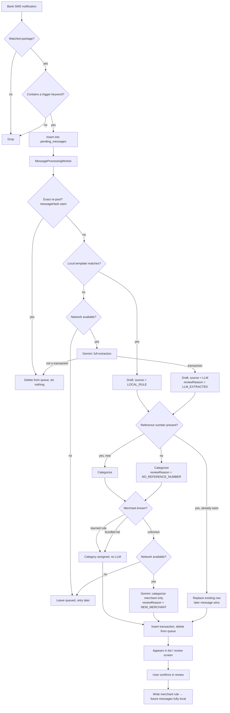

# Expense Tracker — v1a Implementation Doc

Companion to `Design Doc.pdf`. That document explains *why*; this one explains *what to build and in what order*.

Scope here is **v1a only**: the Android core pipeline. No dashboard, no server, no WebRTC.

---

## 1. How to use this document

Read top to bottom — it follows build order. Every code snippet is a starting point, not a finished file: types and structure are settled, but bodies will need real-world tuning (especially the regex templates).

**Three things are deliberately unfinished and marked `TODO(samples)`:**

1. The regex patterns in `rules.json`
2. The trigger keyword list in `AppConfig.kt`
3. The merchant noise-word list in `AppConfig.kt`

All three must be derived from **real HDFC messages**, not guessed. The patterns below are written from the general shape of Indian bank SMS and are illustrative only — they have not been validated against actual HDFC output and should be assumed wrong until tested. Everything around them (the engine, the schema, the fallback) is complete and correct regardless of what the real patterns turn out to be.

---

## 2. Scope recap

**In v1a:**

| Area | Decision |
|---|---|
| Bank | HDFC only |
| Message types | UPI + card swipes only |
| Accounts | All products bundled into one list, no per-account tagging |
| Extraction | Hybrid — local regex templates first, Gemini only as fallback |
| AI | Gemini, your own key, called directly from the app |
| Dedup | Reference-number matching only |
| Categorization | Learned merchant rules → bundled merchant list → Gemini fallback |
| Learning | Confirming an unknown merchant in review teaches it permanently |
| Categories | Full CRUD, expense + income kinds |
| Review | Dedup-uncertain, LLM-extracted, and unknown-merchant items |

**Out of v1a:** dashboard, WebRTC, any server, multi-provider BYOK, manual cash entry, cloud backup, file export, GPS context, silent-failure health check, guided battery-optimization onboarding.

**Accepted limitation:** ColorOS/OxygenOS background-kill may cause missed messages. Not mitigated in v1a.

**Done when:** 1–2 weeks of live use against real HDFC messages looks right on inspection.

---

## 3. Prerequisite before coding

Collect real HDFC SMS covering, at minimum:

- UPI debit (paying a merchant)
- UPI debit (paying a person / raw VPA)
- UPI credit (money received)
- Card swipe debit (POS)
- One promotional message containing "credited" or "cashback" — a **negative** test case

Save them verbatim into `app/src/test/resources/samples/` as a JSON list. These become both the source of the regex patterns and the unit-test fixtures. Sanitize account numbers if you like, but keep the surrounding format byte-identical — the format *is* the data.

---

## 4. Project setup

### Module and SDK

Single Gradle module (`:app`). Modern-only targeting:

```kotlin
// app/build.gradle.kts
android {
    namespace = "com.aryan.expensetracker"
    compileSdk = 35

    defaultConfig {
        applicationId = "com.aryan.expensetracker"
        minSdk = 29
        targetSdk = 35
        testInstrumentationRunner = "androidx.test.runner.AndroidJUnitRunner"
    }

    buildFeatures {
        compose = true
        buildConfig = true   // required for the API key below
    }
}
```

`minSdk = 29` keeps named regex groups (API 26+) and modern notification extras available without compatibility branches.

### Secrets

The Gemini key never appears in source or in `AppConfig.kt`. It lives in a gitignored properties file and reaches the app through `BuildConfig`.

```
# secrets.properties  (gitignored, never committed)
GEMINI_API_KEY=your_key_here
```

```kotlin
// app/build.gradle.kts — above the android { } block
import java.util.Properties

val secrets = Properties()
val secretsFile = rootProject.file("secrets.properties")
if (secretsFile.exists()) {
    secrets.load(secretsFile.inputStream())
}

android {
    defaultConfig {
        val geminiKey = secrets.getProperty("GEMINI_API_KEY") ?: ""
        buildConfigField("String", "GEMINI_API_KEY", "\"$geminiKey\"")
    }
}
```

```gitignore
# .gitignore — add on the very first commit, before any key exists
secrets.properties
local.properties
```

An empty key is not a crash — the app runs, local rules work, and every LLM call fails with a logged message. That is the correct degradation.

### Dependencies

```kotlin
dependencies {
    implementation("androidx.core:core-ktx:1.13.1")
    implementation("androidx.lifecycle:lifecycle-viewmodel-compose:2.8.4")
    implementation("androidx.activity:activity-compose:1.9.1")
    implementation(platform("androidx.compose:compose-bom:2024.09.00"))
    implementation("androidx.compose.material3:material3")
    implementation("androidx.compose.ui:ui")
    implementation("androidx.navigation:navigation-compose:2.8.0")

    implementation("androidx.room:room-runtime:2.6.1")
    implementation("androidx.room:room-ktx:2.6.1")
    ksp("androidx.room:room-compiler:2.6.1")

    implementation("androidx.work:work-runtime-ktx:2.9.1")

    implementation("com.squareup.okhttp3:okhttp:4.12.0")
    implementation("org.jetbrains.kotlinx:kotlinx-serialization-json:1.7.1")

    testImplementation("junit:junit:4.13.2")
    testImplementation("org.jetbrains.kotlinx:kotlinx-coroutines-test:1.8.1")
}
```

No Retrofit — there is exactly one HTTP endpoint, so OkHttp directly is less machinery. No Hilt — manual constructor injection, see §13.

### Manifest

```xml
<uses-permission android:name="android.permission.INTERNET" />

<application
    android:name=".core.ExpenseTrackerApp"
    ... >

    <service
        android:name=".pipeline.capture.SmsNotificationListener"
        android:exported="false"
        android:permission="android.permission.BIND_NOTIFICATION_LISTENER_SERVICE">
        <intent-filter>
            <action android:name="android.service.notification.NotificationListenerService" />
        </intent-filter>
    </service>
</application>
```

Notification access cannot be requested with a runtime dialog. Send the user to settings:

```kotlin
// Opens the system screen where notification access is granted.
fun openNotificationAccessSettings(context: Context) {
    val intent = Intent(Settings.ACTION_NOTIFICATION_LISTENER_SETTINGS)
    context.startActivity(intent)
}
```

---

## 5. Folder structure

Feature-first, single module.

```
com.aryan.expensetracker/
├── core/
│   ├── ExpenseTrackerApp.kt          Application, owns the container
│   ├── AppContainer.kt               manual DI graph
│   ├── config/AppConfig.kt           every tunable constant
│   ├── db/
│   │   ├── AppDatabase.kt
│   │   └── entity/                   TransactionEntity, CategoryEntity,
│   │                                 MerchantRuleEntity, PendingMessageEntity
│   ├── llm/
│   │   ├── GeminiClient.kt           one HTTP call, nothing domain-specific
│   │   └── GeminiSchemas.kt          response schemas as JSON strings
│   ├── net/NetworkChecker.kt
│   ├── nav/AppNavHost.kt
│   └── ui/theme/
├── pipeline/
│   ├── MessagePipeline.kt            orchestrates the stages below
│   ├── MessageProcessingWorker.kt    WorkManager entry point
│   ├── MessageProcessingScheduler.kt
│   ├── capture/
│   │   ├── SmsNotificationListener.kt
│   │   ├── KeywordFilter.kt
│   │   └── PendingMessageDao.kt
│   ├── extraction/
│   │   ├── TransactionDraft.kt
│   │   ├── RuleSet.kt                data classes for rules.json
│   │   ├── RuleSetLoader.kt
│   │   ├── RuleExtractor.kt          local regex path
│   │   └── LlmExtractor.kt           Gemini fallback path
│   ├── categorization/
│   │   ├── MerchantNormalizer.kt
│   │   ├── MerchantRuleDao.kt
│   │   ├── LocalCategorizer.kt
│   │   └── LlmCategorizer.kt
│   └── dedup/DuplicateChecker.kt
└── feature/
    ├── transactions/                 screen, view model, TransactionDao
    ├── review/                       screen, view model
    └── categories/                   screen, view model, CategoryDao
```

**Two structural notes:**

- **No repository layer.** Room DAOs already return `Flow` and already abstract SQL. A repository that forwards calls one-to-one adds a file and a hop for nothing. ViewModels use DAOs directly.
- **DAOs live with their owning feature or pipeline stage**, but entities live in `core/db/entity` because the Room schema is one global thing and several features touch the same rows. `AppDatabase.kt` importing DAOs upward from `feature/` is the single intentional exception to the dependency direction — Room forces it.

---

## 6. Data model

Money is stored as **paise in a `Long`**. Never a `Float` or `Double` — rounding drift on currency is silent and permanent.

Enum-ish columns are stored as `String` so there are no `TypeConverters` in the project at all.

```kotlin
// core/db/entity/TransactionEntity.kt

@Entity(
    tableName = "transactions",
    indices = [
        Index("referenceNumber"),
        Index(value = ["messageHash"], unique = true),
    ],
)
data class TransactionEntity(
    @PrimaryKey(autoGenerate = true) val id: Long = 0,
    val amountPaise: Long,
    val direction: String,            // "DEBIT" | "CREDIT"
    val merchantRaw: String,
    val merchantNormalized: String,
    val categoryId: Long?,
    val referenceNumber: String?,
    val accountTail: String?,
    val occurredAt: Long,             // epoch millis, from the message when parseable
    val capturedAt: Long,             // epoch millis, when we saw it
    val source: String,               // "LOCAL_RULE" | "LLM"
    val needsReview: Boolean,
    val reviewReason: String?,        // see ReviewReason below
    val messageHash: String,
    val rawMessage: String,
)
```

`rawMessage` is kept on-device so the review screen can show what actually arrived, which is what makes "which format needs a new rule?" answerable. It must never reach a log.

```kotlin
// core/db/entity/CategoryEntity.kt

@Entity(tableName = "categories", indices = [Index(value = ["name"], unique = true)])
data class CategoryEntity(
    @PrimaryKey(autoGenerate = true) val id: Long = 0,
    val name: String,
    val kind: String,                 // "EXPENSE" | "INCOME"
    val isDefault: Boolean,
    val sortOrder: Int,
)
```

```kotlin
// core/db/entity/MerchantRuleEntity.kt

@Entity(tableName = "merchant_rules")
data class MerchantRuleEntity(
    @PrimaryKey val normalizedMerchant: String,
    val categoryId: Long,
    val source: String,               // "USER" | "BUNDLED"
    val updatedAt: Long,
)
```

```kotlin
// core/db/entity/PendingMessageEntity.kt

@Entity(tableName = "pending_messages", indices = [Index(value = ["messageHash"], unique = true)])
data class PendingMessageEntity(
    @PrimaryKey(autoGenerate = true) val id: Long = 0,
    val sender: String,
    val body: String,
    val receivedAt: Long,
    val attemptCount: Int,
    val messageHash: String,
)
```

### Review reasons

A transaction carries **one** reason, by this priority. `source` is a separate column, so "was this LLM-extracted?" stays answerable independently and does not need to compete for the reason slot.

```kotlin
// core/db/entity/ReviewReason.kt

/** Why a transaction is sitting in the review list. Highest priority wins. */
object ReviewReason {
    const val NEW_MERCHANT = "NEW_MERCHANT"                 // confirming this teaches the app
    const val LLM_EXTRACTED = "LLM_EXTRACTED"               // no local rule matched
    const val NO_REFERENCE_NUMBER = "NO_REFERENCE_NUMBER"   // could not be dedup-checked
}
```

### DAOs

```kotlin
// feature/transactions/TransactionDao.kt

@Dao
interface TransactionDao {

    // Newest first, for the main list.
    @Query("SELECT * FROM transactions ORDER BY occurredAt DESC")
    fun observeAll(): Flow<List<TransactionEntity>>

    // Everything the user still needs to look at.
    @Query("SELECT * FROM transactions WHERE needsReview = 1 ORDER BY occurredAt DESC")
    fun observeNeedingReview(): Flow<List<TransactionEntity>>

    // Exact re-post check: Android re-delivers the same notification on update.
    @Query("SELECT EXISTS(SELECT 1 FROM transactions WHERE messageHash = :hash)")
    suspend fun existsByHash(hash: String): Boolean

    // Same-transaction check: two bank messages sharing one reference number.
    @Query("SELECT * FROM transactions WHERE referenceNumber = :reference AND occurredAt >= :since LIMIT 1")
    suspend fun findByReference(reference: String, since: Long): TransactionEntity?

    @Insert
    suspend fun insert(transaction: TransactionEntity): Long

    @Update
    suspend fun update(transaction: TransactionEntity)

    @Delete
    suspend fun delete(transaction: TransactionEntity)

    // Used when a category is deleted and its transactions move elsewhere.
    @Query("UPDATE transactions SET categoryId = :toCategoryId WHERE categoryId = :fromCategoryId")
    suspend fun reassignCategory(fromCategoryId: Long, toCategoryId: Long)
}
```

`existsByHash` and `findByReference` answer two genuinely different questions — identical text arriving twice, versus two different messages describing one purchase — so they stay two queries rather than one clever merged one.

```kotlin
// feature/categories/CategoryDao.kt

@Dao
interface CategoryDao {

    @Query("SELECT * FROM categories ORDER BY sortOrder, name")
    fun observeAll(): Flow<List<CategoryEntity>>

    @Query("SELECT * FROM categories ORDER BY sortOrder, name")
    suspend fun getAll(): List<CategoryEntity>

    @Query("SELECT id FROM categories WHERE name = :name LIMIT 1")
    suspend fun findIdByName(name: String): Long?

    @Query("SELECT COUNT(*) FROM categories")
    suspend fun count(): Int

    @Insert
    suspend fun insert(category: CategoryEntity): Long

    @Update
    suspend fun update(category: CategoryEntity)

    @Delete
    suspend fun delete(category: CategoryEntity)
}
```

```kotlin
// pipeline/categorization/MerchantRuleDao.kt

@Dao
interface MerchantRuleDao {

    @Query("SELECT * FROM merchant_rules WHERE normalizedMerchant = :merchant LIMIT 1")
    suspend fun findByMerchant(merchant: String): MerchantRuleEntity?

    // Recent user corrections, used as examples in the categorization prompt.
    @Query("SELECT * FROM merchant_rules WHERE source = 'USER' ORDER BY updatedAt DESC LIMIT :limit")
    suspend fun recentUserRules(limit: Int): List<MerchantRuleEntity>

    @Insert(onConflict = OnConflictStrategy.REPLACE)
    suspend fun upsert(rule: MerchantRuleEntity)

    @Query("DELETE FROM merchant_rules WHERE categoryId = :categoryId")
    suspend fun deleteByCategory(categoryId: Long)
}
```

```kotlin
// pipeline/capture/PendingMessageDao.kt

@Dao
interface PendingMessageDao {

    @Query("SELECT * FROM pending_messages ORDER BY receivedAt ASC")
    suspend fun getAll(): List<PendingMessageEntity>

    // IGNORE, not REPLACE: a repeated notification must not reset attemptCount.
    @Insert(onConflict = OnConflictStrategy.IGNORE)
    suspend fun insert(message: PendingMessageEntity)

    @Query("UPDATE pending_messages SET attemptCount = attemptCount + 1 WHERE id = :id")
    suspend fun incrementAttempts(id: Long)

    @Delete
    suspend fun delete(message: PendingMessageEntity)
}
```

```kotlin
// core/db/AppDatabase.kt

@Database(
    entities = [
        TransactionEntity::class,
        CategoryEntity::class,
        MerchantRuleEntity::class,
        PendingMessageEntity::class,
    ],
    version = 1,
    exportSchema = true,
)
abstract class AppDatabase : RoomDatabase() {
    abstract fun transactionDao(): TransactionDao
    abstract fun categoryDao(): CategoryDao
    abstract fun merchantRuleDao(): MerchantRuleDao
    abstract fun pendingMessageDao(): PendingMessageDao
}
```

---

## 7. Configuration

### AppConfig.kt

Every tunable in the app lives here. No secrets.

```kotlin
// core/config/AppConfig.kt

/** Every tunable constant in the app. Secrets do not belong here — see BuildConfig. */
object AppConfig {

    // Notification packages worth reading. Everything else is dropped immediately.
    val WATCHED_PACKAGES: Set<String> = setOf(
        "com.google.android.apps.messaging",
        "com.samsung.android.messaging",
        "com.oneplus.mms",
    )

    // TODO(samples): rebuild from real HDFC messages. Cheap first-pass filter only.
    val TRIGGER_KEYWORDS: List<String> = listOf(
        "debited", "credited", "spent", "upi", "txn", "withdrawn",
    )

    // TODO(samples): tune once real merchant strings are in hand.
    val MERCHANT_NOISE_WORDS: Set<String> = setOf(
        "PVT", "LTD", "PRIVATE", "LIMITED", "INDIA", "IN", "POS", "PAYMENT",
    )

    // Two messages for one purchase normally arrive within a few days of each other.
    const val DEDUP_LOOKBACK_MS: Long = 7L * 24 * 60 * 60 * 1000

    // A message longer than this is not a bank SMS.
    const val MAX_MESSAGE_LENGTH: Int = 1000

    // Bank timestamps carry no zone; HDFC sends IST.
    const val BANK_TIME_ZONE: String = "Asia/Kolkata"

    // TODO: confirm the current model id against Google's docs before first run.
    const val GEMINI_MODEL: String = "gemini-2.5-flash"
    const val GEMINI_ENDPOINT: String =
        "https://generativelanguage.googleapis.com/v1beta/models/%s:generateContent"
    const val GEMINI_TIMEOUT_SECONDS: Long = 30

    // How many past user corrections to show the model when categorizing.
    const val MAX_CORRECTION_EXAMPLES: Int = 15

    // Give up on a message after this many failed processing attempts.
    const val MAX_PROCESSING_ATTEMPTS: Int = 10

    const val WORKER_BACKOFF_SECONDS: Long = 30

    const val RULES_ASSET_NAME: String = "rules.json"

    // Seeded on first run. The user can add, rename, and delete freely afterwards.
    val DEFAULT_EXPENSE_CATEGORIES: List<String> = listOf(
        "Food", "Travel", "Groceries", "Utilities", "Housing", "Entertainment", "Investments",
    )
    val DEFAULT_INCOME_CATEGORIES: List<String> = listOf("Income")
}
```

Trigger keywords live here rather than in `rules.json` because they are a flat tunable list, and the config file is the one place tunables are meant to live. `rules.json` holds only the structured extraction knowledge.

### rules.json

Bundled at `app/src/main/assets/rules.json`. Declarative so patterns can be edited without touching Kotlin, and so the same file can later be served from a server without redesigning anything.

> **TODO(samples): every pattern below is illustrative and unverified.** They describe the general shape of Indian bank SMS, not confirmed HDFC output. Replace them with patterns derived from real messages before expecting anything to match.

```json
{
  "version": 1,
  "templates": [
    {
      "id": "hdfc_upi_debit_v1",
      "direction": "DEBIT",
      "dateFormat": "dd/MM/yy",
      "pattern": "Sent Rs\\.?(?<amount>[\\d,]+(?:\\.\\d{1,2})?)\\s+From HDFC Bank A/C\\s*(?<account>[Xx*\\d]+)\\s+To\\s+(?<merchant>.+?)\\s+On\\s+(?<date>\\d{2}/\\d{2}/\\d{2}).*?Ref\\s*(?:No\\.?)?\\s*(?<reference>\\d+)"
    },
    {
      "id": "hdfc_card_debit_v1",
      "direction": "DEBIT",
      "dateFormat": "dd-MM-yy",
      "pattern": "Rs\\.?(?<amount>[\\d,]+(?:\\.\\d{1,2})?)\\s+spent on HDFC Bank Card\\s*(?<account>[Xx*\\d]+)\\s+at\\s+(?<merchant>.+?)\\s+on\\s+(?<date>\\d{2}-\\d{2}-\\d{2})"
    },
    {
      "id": "hdfc_upi_credit_v1",
      "direction": "CREDIT",
      "dateFormat": "dd/MM/yy",
      "pattern": "Rs\\.?(?<amount>[\\d,]+(?:\\.\\d{1,2})?)\\s+credited to.*?A/C\\s*(?<account>[Xx*\\d]+)\\s+.*?from\\s+(?<merchant>.+?)\\s+on\\s+(?<date>\\d{2}/\\d{2}/\\d{2}).*?Ref\\s*(?:No\\.?)?\\s*(?<reference>\\d+)"
    }
  ],
  "merchants": {
    "SWIGGY": "Food",
    "ZOMATO": "Food",
    "UBER": "Travel",
    "OLA": "Travel",
    "BLINKIT": "Groceries",
    "ZEPTO": "Groceries"
  }
}
```

Named groups the engine understands: `amount` (required), `merchant` (required), `account`, `date`, `reference`. A template not declaring a group simply yields `null` for that field.

```kotlin
// pipeline/extraction/RuleSet.kt

@Serializable
data class RuleSetJson(
    val version: Int,
    val templates: List<RuleTemplateJson>,
    val merchants: Map<String, String>,
)

@Serializable
data class RuleTemplateJson(
    val id: String,
    val direction: String,
    val dateFormat: String? = null,
    val pattern: String,
)

/** Runtime form: patterns are compiled once at load, not per message. */
data class RuleTemplate(
    val id: String,
    val direction: String,
    val dateFormat: String?,
    val regex: Regex,
)

data class RuleSet(
    val templates: List<RuleTemplate>,
    val merchants: Map<String, String>,
)
```

```kotlin
// pipeline/extraction/RuleSetLoader.kt

private const val TAG = "RuleSetLoader"

class RuleSetLoader(private val context: Context, private val json: Json) {

    // Reads and compiles the bundled rule set. A broken file must not take the app down.
    fun load(): RuleSet {
        try {
            val text = context.assets.open(AppConfig.RULES_ASSET_NAME).bufferedReader().use { it.readText() }
            val parsed = json.decodeFromString<RuleSetJson>(text)
            return RuleSet(
                templates = compileTemplates(parsed.templates),
                merchants = parsed.merchants,
            )
        } catch (e: Exception) {
            Log.e(TAG, "Could not load ${AppConfig.RULES_ASSET_NAME}; running with no local rules", e)
            return RuleSet(templates = emptyList(), merchants = emptyMap())
        }
    }

    // Compiles each pattern, skipping any that is malformed rather than failing the whole set.
    private fun compileTemplates(templates: List<RuleTemplateJson>): List<RuleTemplate> {
        val compiled = mutableListOf<RuleTemplate>()
        for (template in templates) {
            try {
                compiled.add(
                    RuleTemplate(
                        id = template.id,
                        direction = template.direction,
                        dateFormat = template.dateFormat,
                        regex = Regex(template.pattern, RegexOption.IGNORE_CASE),
                    )
                )
            } catch (e: Exception) {
                Log.e(TAG, "Skipping template '${template.id}': pattern will not compile", e)
            }
        }
        return compiled
    }
}
```

An empty rule set is a valid, survivable state: every message falls through to the LLM, which is exactly what should happen on day one before any patterns exist.

---

## 8. Data flow



Two things worth noticing in that graph:

**Every message is queued before any work happens.** If the process is killed mid-processing — which on OxygenOS is a matter of when, not if — nothing is lost. It is one code path, not a fast path and a slow path.

**Gemini is called two different ways, carrying different amounts of data.** Full extraction sends the message text because it has to. Categorization sends only a normalized merchant name and an amount — no account number, no reference, no message body. Most fallbacks are the second kind, so the common case leaks far less than "message text goes to the AI" suggests.

---

## 9. Pipeline

### Capture

```kotlin
// pipeline/capture/KeywordFilter.kt

class KeywordFilter(private val keywords: List<String>) {

    // Cheap first pass. Runs on every notification, so it stays a plain substring scan.
    fun looksLikeBankMessage(body: String): Boolean {
        if (body.isBlank()) return false
        if (body.length > AppConfig.MAX_MESSAGE_LENGTH) return false

        val lowercased = body.lowercase(Locale.ROOT)
        for (keyword in keywords) {
            if (lowercased.contains(keyword)) return true
        }
        return false
    }
}
```

```kotlin
// pipeline/capture/SmsNotificationListener.kt

private const val TAG = "SmsNotificationListener"

class SmsNotificationListener : NotificationListenerService() {

    private val scope = CoroutineScope(SupervisorJob() + Dispatchers.IO)

    // Called for every notification on the device, so it must return fast.
    override fun onNotificationPosted(sbn: StatusBarNotification) {
        if (sbn.packageName !in AppConfig.WATCHED_PACKAGES) return

        val container = (applicationContext as ExpenseTrackerApp).container
        val body = readMessageBody(sbn) ?: return
        if (!container.keywordFilter.looksLikeBankMessage(body)) return

        val sender = sbn.notification.extras.getCharSequence(Notification.EXTRA_TITLE)?.toString().orEmpty()
        enqueue(sender, body)
    }

    // Prefers the expanded text, which is the only place the full SMS survives.
    private fun readMessageBody(sbn: StatusBarNotification): String? {
        val extras = sbn.notification.extras
        val bigText = extras.getCharSequence(Notification.EXTRA_BIG_TEXT)
        if (bigText != null) return bigText.toString()

        val text = extras.getCharSequence(Notification.EXTRA_TEXT)
        if (text != null) return text.toString()

        return null
    }

    // Stores the message and kicks the worker. Storing first means nothing is lost.
    private fun enqueue(sender: String, body: String) {
        val container = (applicationContext as ExpenseTrackerApp).container
        scope.launch {
            try {
                container.pendingMessageDao.insert(
                    PendingMessageEntity(
                        sender = sender,
                        body = body,
                        receivedAt = System.currentTimeMillis(),
                        attemptCount = 0,
                        messageHash = hashMessage(sender, body),
                    )
                )
                MessageProcessingScheduler.enqueue(applicationContext)
            } catch (e: Exception) {
                Log.e(TAG, "Could not queue a captured message (length ${body.length})", e)
            }
        }
    }

    override fun onDestroy() {
        super.onDestroy()
        scope.cancel()
    }
}
```

The log line records the message *length*, never its content. That rule holds everywhere in the pipeline.

```kotlin
// pipeline/capture/MessageHash.kt

// Stable identity for a captured message, used to ignore repeated notification posts.
fun hashMessage(sender: String, body: String): String {
    val digest = MessageDigest.getInstance("SHA-256")
    val bytes = digest.digest("$sender|$body".toByteArray())
    return bytes.joinToString("") { "%02x".format(it) }
}
```

### Extraction — local

```kotlin
// pipeline/extraction/TransactionDraft.kt

data class TransactionDraft(
    val amountPaise: Long,
    val direction: String,
    val merchantRaw: String,
    val referenceNumber: String?,
    val accountTail: String?,
    val occurredAt: Long,
    val source: String,
)
```

```kotlin
// pipeline/extraction/RuleExtractor.kt

private const val TAG = "RuleExtractor"

class RuleExtractor(private val ruleSet: RuleSet) {

    // Returns the first template that matches, or null when none do.
    fun extract(body: String, receivedAt: Long): TransactionDraft? {
        for (template in ruleSet.templates) {
            val draft = applyTemplate(template, body, receivedAt)
            if (draft != null) return draft
        }
        return null
    }

    // Builds a draft from one template's named groups.
    private fun applyTemplate(template: RuleTemplate, body: String, receivedAt: Long): TransactionDraft? {
        val match = template.regex.find(body) ?: return null

        val amountText = match.groupOrNull(template.id, "amount") ?: return null
        val amountPaise = parseAmountToPaise(amountText) ?: return null
        val merchant = match.groupOrNull(template.id, "merchant") ?: return null

        val dateText = match.groupOrNull(template.id, "date")
        val occurredAt = parseOccurredAt(dateText, template.dateFormat, receivedAt)

        return TransactionDraft(
            amountPaise = amountPaise,
            direction = template.direction,
            merchantRaw = merchant.trim(),
            referenceNumber = match.groupOrNull(template.id, "reference"),
            accountTail = match.groupOrNull(template.id, "account")?.takeLast(4),
            occurredAt = occurredAt,
            source = "LOCAL_RULE",
        )
    }

    // Falls back to arrival time when the message has no parseable date.
    private fun parseOccurredAt(dateText: String?, dateFormat: String?, receivedAt: Long): Long {
        if (dateText == null || dateFormat == null) return receivedAt
        try {
            val formatter = DateTimeFormatter.ofPattern(dateFormat, Locale.ENGLISH)
            val date = LocalDate.parse(dateText, formatter)
            return date.atStartOfDay(ZoneId.of(AppConfig.BANK_TIME_ZONE)).toInstant().toEpochMilli()
        } catch (e: DateTimeParseException) {
            Log.w(TAG, "Date '$dateText' did not match format '$dateFormat'; using arrival time")
            return receivedAt
        }
    }
}

// Reads a named group, tolerating templates that do not declare it.
private fun MatchResult.groupOrNull(templateId: String, name: String): String? {
    val named = groups as? MatchNamedGroupCollection ?: return null
    try {
        return named[name]?.value
    } catch (e: IllegalArgumentException) {
        Log.w(TAG, "Template '$templateId' has no group '$name'")
        return null
    }
}

// Converts "1,234.50" to 123450 paise. Decimal, never floating point.
fun parseAmountToPaise(text: String): Long? {
    val cleaned = text.replace(",", "").trim()
    val value = cleaned.toBigDecimalOrNull() ?: return null
    return value.movePointRight(2).setScale(0, RoundingMode.HALF_UP).toLong()
}
```

### Extraction — Gemini fallback

```kotlin
// pipeline/extraction/LlmExtractor.kt

enum class LlmOutcome { SUCCESS, NOT_A_TRANSACTION, CALL_FAILED }

data class LlmExtractionResult(val outcome: LlmOutcome, val draft: TransactionDraft?)

@Serializable
private data class ExtractionJson(
    val isTransaction: Boolean,
    val amount: String? = null,
    val direction: String? = null,
    val merchant: String? = null,
    val referenceNumber: String? = null,
    val accountTail: String? = null,
    val occurredOn: String? = null,
)

private const val TAG = "LlmExtractor"

private const val SYSTEM_INSTRUCTION = """
You read SMS messages from Indian banks and return structured data about the transaction they describe.

Set isTransaction to false when the message is not a completed money movement — one-time passwords,
balance enquiries, offers, reminders, and marketing all count as false. A message advertising
"cashback credited on your next order" is marketing, not a transaction.

amount is the rupee value as a plain decimal string, no symbol and no thousands separators.
direction is DEBIT when money left the account and CREDIT when money arrived.
merchant is the counterparty's clean display name: strip terminal ids, city names, and reference
digits. For a UPI id, use the part before the @ unless it is only digits.
occurredOn is the transaction date in YYYY-MM-DD form, or null when the message does not state it.
"""

class LlmExtractor(private val geminiClient: GeminiClient, private val json: Json) {

    // Full extraction for messages no local template matched.
    suspend fun extract(body: String, receivedAt: Long): LlmExtractionResult {
        val responseText = geminiClient.generateJson(
            systemInstruction = SYSTEM_INSTRUCTION,
            userText = body,
            responseSchema = GeminiSchemas.EXTRACTION,
        ) ?: return LlmExtractionResult(LlmOutcome.CALL_FAILED, null)

        val parsed = parseResponse(responseText) ?: return LlmExtractionResult(LlmOutcome.CALL_FAILED, null)
        if (!parsed.isTransaction) return LlmExtractionResult(LlmOutcome.NOT_A_TRANSACTION, null)

        val draft = toDraft(parsed, receivedAt) ?: return LlmExtractionResult(LlmOutcome.CALL_FAILED, null)
        return LlmExtractionResult(LlmOutcome.SUCCESS, draft)
    }

    // Reads the model's JSON, treating anything unparseable as a failed call.
    private fun parseResponse(responseText: String): ExtractionJson? {
        try {
            return json.decodeFromString<ExtractionJson>(responseText)
        } catch (e: Exception) {
            Log.e(TAG, "Model returned JSON that did not fit the extraction schema", e)
            return null
        }
    }

    // Converts the model's strings into the same draft shape the local path produces.
    private fun toDraft(parsed: ExtractionJson, receivedAt: Long): TransactionDraft? {
        val amountPaise = parsed.amount?.let { parseAmountToPaise(it) } ?: return null
        val direction = parsed.direction ?: return null
        val merchant = parsed.merchant ?: return null

        return TransactionDraft(
            amountPaise = amountPaise,
            direction = direction,
            merchantRaw = merchant.trim(),
            referenceNumber = parsed.referenceNumber,
            accountTail = parsed.accountTail?.takeLast(4),
            occurredAt = parseIsoDate(parsed.occurredOn, receivedAt),
            source = "LLM",
        )
    }

    // Accepts the model's date when it gave one, otherwise falls back to arrival time.
    private fun parseIsoDate(isoDate: String?, receivedAt: Long): Long {
        if (isoDate == null) return receivedAt
        try {
            return LocalDate.parse(isoDate)
                .atStartOfDay(ZoneId.of(AppConfig.BANK_TIME_ZONE))
                .toInstant()
                .toEpochMilli()
        } catch (e: DateTimeParseException) {
            Log.w(TAG, "Model returned an unparseable date; using arrival time")
            return receivedAt
        }
    }
}
```

### Categorization

```kotlin
// pipeline/categorization/MerchantNormalizer.kt

private val NON_NAME_CHARS = Regex("[^A-Z ]")
private val WHITESPACE = Regex("\\s+")

class MerchantNormalizer(private val noiseWords: Set<String>) {

    // Produces a stable lookup key so the same shop matches across messages.
    fun normalize(raw: String): String {
        val withoutDomain = stripVpaDomain(raw)
        val cleaned = withoutDomain.uppercase(Locale.ROOT).replace(NON_NAME_CHARS, " ")
        val meaningful = removeNoiseWords(cleaned).replace(WHITESPACE, " ").trim()

        // A numeric UPI id reduces to nothing; keep the raw handle so it can still be learned.
        if (meaningful.isBlank()) {
            return withoutDomain.uppercase(Locale.ROOT).trim()
        }
        return meaningful
    }

    // "swiggy@okhdfcbank" and "9876543210@ybl" both lose the provider suffix.
    private fun stripVpaDomain(raw: String): String {
        val atIndex = raw.indexOf('@')
        if (atIndex <= 0) return raw
        return raw.substring(0, atIndex)
    }

    // Drops corporate-suffix and location noise that varies between messages.
    private fun removeNoiseWords(text: String): String {
        val kept = text.split(" ").filter { it.isNotBlank() && it !in noiseWords }
        return kept.joinToString(" ")
    }
}
```

```kotlin
// pipeline/categorization/LocalCategorizer.kt

class LocalCategorizer(
    private val merchantRuleDao: MerchantRuleDao,
    private val categoryDao: CategoryDao,
    private val ruleSet: RuleSet,
) {

    // What the user taught wins over what shipped in the app.
    suspend fun categoryIdFor(normalizedMerchant: String): Long? {
        if (normalizedMerchant.isBlank()) return null

        val learned = merchantRuleDao.findByMerchant(normalizedMerchant)
        if (learned != null) return learned.categoryId

        val bundledName = ruleSet.merchants[normalizedMerchant] ?: return null
        return categoryDao.findIdByName(bundledName)
    }
}
```

```kotlin
// pipeline/categorization/LlmCategorizer.kt

@Serializable
private data class CategorizationJson(val category: String?)

private const val TAG = "LlmCategorizer"

private const val SYSTEM_INSTRUCTION = """
You assign a spending category to a merchant. You will be given the available category names,
some of the user's own past choices, and one merchant to classify.

Reply with exactly one of the given category names. Reply with null when none of them fit —
a wrong category is worse than no category, because no category asks the user instead of guessing.
Follow the user's past choices when they conflict with the obvious answer; they know their own spending.
"""

class LlmCategorizer(
    private val geminiClient: GeminiClient,
    private val categoryDao: CategoryDao,
    private val merchantRuleDao: MerchantRuleDao,
    private val json: Json,
) {

    // Categorizes a single merchant. Only the merchant name leaves the phone, not the message.
    suspend fun categoryIdFor(normalizedMerchant: String, direction: String): Long? {
        val categories = categoryDao.getAll().filter { it.kind == kindFor(direction) }
        if (categories.isEmpty()) return null

        val prompt = buildPrompt(normalizedMerchant, categories)
        val responseText = geminiClient.generateJson(
            systemInstruction = SYSTEM_INSTRUCTION,
            userText = prompt,
            responseSchema = GeminiSchemas.CATEGORIZATION,
        ) ?: return null

        val chosenName = readChosenCategory(responseText) ?: return null
        return categories.firstOrNull { it.name.equals(chosenName, ignoreCase = true) }?.id
    }

    // Past user corrections go in as examples — this is the app learning the person, not the shop.
    private suspend fun buildPrompt(merchant: String, categories: List<CategoryEntity>): String {
        val names = categories.joinToString(", ") { it.name }
        val corrections = merchantRuleDao.recentUserRules(AppConfig.MAX_CORRECTION_EXAMPLES)
        val examples = corrections.joinToString("\n") { rule ->
            val categoryName = categories.firstOrNull { it.id == rule.categoryId }?.name ?: "unknown"
            "${rule.normalizedMerchant} -> $categoryName"
        }

        return buildString {
            appendLine("Available categories: $names")
            if (examples.isNotEmpty()) {
                appendLine()
                appendLine("The user has previously chosen:")
                appendLine(examples)
            }
            appendLine()
            append("Merchant to classify: $merchant")
        }
    }

    // Reads the single category name out of the model's reply.
    private fun readChosenCategory(responseText: String): String? {
        try {
            return json.decodeFromString<CategorizationJson>(responseText).category
        } catch (e: Exception) {
            Log.e(TAG, "Model returned JSON that did not fit the categorization schema", e)
            return null
        }
    }

    // Money coming in is categorized against income categories, not expense ones.
    private fun kindFor(direction: String): String {
        if (direction == "CREDIT") return "INCOME"
        return "EXPENSE"
    }
}
```

### Dedup

```kotlin
// pipeline/dedup/DuplicateChecker.kt

sealed interface DuplicateDecision {
    data object New : DuplicateDecision
    data class Replaces(val existing: TransactionEntity) : DuplicateDecision
}

class DuplicateChecker(private val transactionDao: TransactionDao) {

    // True when this exact notification text has already been turned into a transaction.
    suspend fun isRepost(messageHash: String): Boolean {
        return transactionDao.existsByHash(messageHash)
    }

    // Two messages sharing a reference number describe one purchase; the later wins.
    suspend fun check(referenceNumber: String?): DuplicateDecision {
        if (referenceNumber.isNullOrBlank()) return DuplicateDecision.New

        val since = System.currentTimeMillis() - AppConfig.DEDUP_LOOKBACK_MS
        val existing = transactionDao.findByReference(referenceNumber, since) ?: return DuplicateDecision.New
        return DuplicateDecision.Replaces(existing)
    }
}
```

`DuplicateDecision` is a two-case result type, not an error hierarchy — it exists because "new" and "replaces this specific row" carry different data, and a nullable return would lose that.

### Orchestration

```kotlin
// pipeline/MessagePipeline.kt

enum class PipelineOutcome { SAVED, IGNORED, RETRY_LATER }

private const val TAG = "MessagePipeline"

class MessagePipeline(
    private val ruleExtractor: RuleExtractor,
    private val llmExtractor: LlmExtractor,
    private val merchantNormalizer: MerchantNormalizer,
    private val localCategorizer: LocalCategorizer,
    private val llmCategorizer: LlmCategorizer,
    private val duplicateChecker: DuplicateChecker,
    private val transactionDao: TransactionDao,
    private val networkChecker: NetworkChecker,
) {

    // Turns one queued message into a stored transaction, or explains why it could not.
    suspend fun process(message: PendingMessageEntity): PipelineOutcome {
        if (duplicateChecker.isRepost(message.messageHash)) return PipelineOutcome.IGNORED

        val local = ruleExtractor.extract(message.body, message.receivedAt)
        if (local != null) return finish(local, message, ReviewReason.NO_REFERENCE_NUMBER.takeIf { local.referenceNumber == null })

        if (!networkChecker.isOnline()) return PipelineOutcome.RETRY_LATER

        val result = llmExtractor.extract(message.body, message.receivedAt)
        return when (result.outcome) {
            LlmOutcome.CALL_FAILED -> PipelineOutcome.RETRY_LATER
            LlmOutcome.NOT_A_TRANSACTION -> PipelineOutcome.IGNORED
            LlmOutcome.SUCCESS -> finish(result.draft!!, message, ReviewReason.LLM_EXTRACTED)
        }
    }

    // Categorizes, dedups, and writes the row.
    private suspend fun finish(
        draft: TransactionDraft,
        message: PendingMessageEntity,
        baseReviewReason: String?,
    ): PipelineOutcome {
        val normalized = merchantNormalizer.normalize(draft.merchantRaw)

        val knownCategoryId = localCategorizer.categoryIdFor(normalized)
        if (knownCategoryId != null) {
            return store(draft, message, normalized, knownCategoryId, baseReviewReason)
        }

        if (!networkChecker.isOnline()) return PipelineOutcome.RETRY_LATER

        // An unknown merchant is the moment the app can learn something, so it always goes to review.
        val guessedCategoryId = llmCategorizer.categoryIdFor(normalized, draft.direction)
        return store(draft, message, normalized, guessedCategoryId, ReviewReason.NEW_MERCHANT)
    }

    // Writes a new row, or updates the one this message supersedes.
    private suspend fun store(
        draft: TransactionDraft,
        message: PendingMessageEntity,
        normalizedMerchant: String,
        categoryId: Long?,
        reviewReason: String?,
    ): PipelineOutcome {
        val entity = buildEntity(draft, message, normalizedMerchant, categoryId, reviewReason)

        when (val decision = duplicateChecker.check(draft.referenceNumber)) {
            is DuplicateDecision.New -> transactionDao.insert(entity)
            is DuplicateDecision.Replaces -> {
                // Keep the row's identity and any category the user already chose by hand.
                transactionDao.update(
                    entity.copy(
                        id = decision.existing.id,
                        categoryId = categoryId ?: decision.existing.categoryId,
                    )
                )
            }
        }
        return PipelineOutcome.SAVED
    }

    // Assembles the stored row. Review is required whenever anything was uncertain.
    private fun buildEntity(
        draft: TransactionDraft,
        message: PendingMessageEntity,
        normalizedMerchant: String,
        categoryId: Long?,
        reviewReason: String?,
    ): TransactionEntity {
        val needsReview = reviewReason != null || categoryId == null
        return TransactionEntity(
            amountPaise = draft.amountPaise,
            direction = draft.direction,
            merchantRaw = draft.merchantRaw,
            merchantNormalized = normalizedMerchant,
            categoryId = categoryId,
            referenceNumber = draft.referenceNumber,
            accountTail = draft.accountTail,
            occurredAt = draft.occurredAt,
            capturedAt = message.receivedAt,
            source = draft.source,
            needsReview = needsReview,
            reviewReason = reviewReason,
            messageHash = message.messageHash,
            rawMessage = message.body,
        )
    }
}
```

---

## 10. Gemini client

```kotlin
// core/llm/GeminiSchemas.kt

/** Response schemas, sent so the model cannot reply with prose. */
object GeminiSchemas {

    const val EXTRACTION: String = """
    {
      "type": "object",
      "properties": {
        "isTransaction":   { "type": "boolean" },
        "amount":          { "type": "string", "nullable": true },
        "direction":       { "type": "string", "enum": ["DEBIT", "CREDIT"], "nullable": true },
        "merchant":        { "type": "string", "nullable": true },
        "referenceNumber": { "type": "string", "nullable": true },
        "accountTail":     { "type": "string", "nullable": true },
        "occurredOn":      { "type": "string", "nullable": true }
      },
      "required": ["isTransaction"]
    }
    """

    const val CATEGORIZATION: String = """
    {
      "type": "object",
      "properties": {
        "category": { "type": "string", "nullable": true }
      },
      "required": ["category"]
    }
    """
}
```

```kotlin
// core/llm/GeminiClient.kt

private const val TAG = "GeminiClient"
private val JSON_MEDIA_TYPE = "application/json".toMediaType()

class GeminiClient(
    private val httpClient: OkHttpClient,
    private val apiKey: String,
    private val json: Json,
) {

    // Sends one prompt and returns the JSON text the model produced, or null when the call failed.
    suspend fun generateJson(
        systemInstruction: String,
        userText: String,
        responseSchema: String,
    ): String? = withContext(Dispatchers.IO) {
        if (apiKey.isBlank()) {
            Log.e(TAG, "No Gemini API key configured; add one to secrets.properties")
            return@withContext null
        }

        val request = buildRequest(systemInstruction, userText, responseSchema)
        try {
            httpClient.newCall(request).execute().use { response ->
                if (!response.isSuccessful) {
                    Log.e(TAG, "Gemini call failed with HTTP ${response.code}")
                    return@withContext null
                }
                val body = response.body?.string()
                if (body == null) {
                    Log.e(TAG, "Gemini returned an empty body")
                    return@withContext null
                }
                return@withContext readGeneratedText(body)
            }
        } catch (e: IOException) {
            Log.e(TAG, "Gemini call could not complete", e)
            return@withContext null
        }
    }

    // Builds the request. The key goes in a header, never in the URL.
    private fun buildRequest(systemInstruction: String, userText: String, responseSchema: String): Request {
        val payload = """
        {
          "systemInstruction": { "parts": [ { "text": ${json.encodeToString(systemInstruction)} } ] },
          "contents": [ { "parts": [ { "text": ${json.encodeToString(userText)} } ] } ],
          "generationConfig": {
            "temperature": 0,
            "responseMimeType": "application/json",
            "responseSchema": $responseSchema
          }
        }
        """.trimIndent()

        val url = AppConfig.GEMINI_ENDPOINT.format(AppConfig.GEMINI_MODEL)
        return Request.Builder()
            .url(url)
            .addHeader("x-goog-api-key", apiKey)
            .post(payload.toRequestBody(JSON_MEDIA_TYPE))
            .build()
    }

    // Digs the generated text out of Gemini's response envelope.
    private fun readGeneratedText(responseBody: String): String? {
        try {
            val root = json.parseToJsonElement(responseBody).jsonObject
            val candidates = root["candidates"]?.jsonArray
            if (candidates.isNullOrEmpty()) {
                Log.e(TAG, "Gemini response contained no candidates")
                return null
            }
            return candidates[0].jsonObject["content"]
                ?.jsonObject?.get("parts")
                ?.jsonArray?.get(0)
                ?.jsonObject?.get("text")
                ?.jsonPrimitive?.content
        } catch (e: Exception) {
            Log.e(TAG, "Gemini response was not in the expected shape", e)
            return null
        }
    }
}
```

`json.encodeToString(String)` is doing the string-escaping so a message containing quotes or newlines cannot break the payload. Note that no log line here ever includes `userText`.

```kotlin
// core/net/NetworkChecker.kt

class NetworkChecker(private val connectivityManager: ConnectivityManager) {

    // True when the device currently has validated internet access.
    fun isOnline(): Boolean {
        val network = connectivityManager.activeNetwork ?: return false
        val capabilities = connectivityManager.getNetworkCapabilities(network) ?: return false
        return capabilities.hasCapability(NetworkCapabilities.NET_CAPABILITY_VALIDATED)
    }
}
```

---

## 11. Background execution

```kotlin
// pipeline/MessageProcessingWorker.kt

private const val TAG = "MessageProcessingWorker"

class MessageProcessingWorker(
    context: Context,
    params: WorkerParameters,
) : CoroutineWorker(context, params) {

    // Drains the queue. Anything that could not be finished stays queued for the next run.
    override suspend fun doWork(): Result {
        val container = (applicationContext as ExpenseTrackerApp).container
        val pending = container.pendingMessageDao.getAll()
        if (pending.isEmpty()) return Result.success()

        var needsRetry = false
        for (message in pending) {
            val outcome = processOne(container, message)
            if (outcome == PipelineOutcome.RETRY_LATER) needsRetry = true
        }

        if (needsRetry) return Result.retry()
        return Result.success()
    }

    // Handles a single message, giving up on it after too many failed attempts.
    private suspend fun processOne(container: AppContainer, message: PendingMessageEntity): PipelineOutcome {
        try {
            val outcome = container.messagePipeline.process(message)
            when (outcome) {
                PipelineOutcome.SAVED, PipelineOutcome.IGNORED -> container.pendingMessageDao.delete(message)
                PipelineOutcome.RETRY_LATER -> handleRetry(container, message)
            }
            return outcome
        } catch (e: Exception) {
            Log.e(TAG, "Processing failed for queued message ${message.id}", e)
            handleRetry(container, message)
            return PipelineOutcome.RETRY_LATER
        }
    }

    // Counts the attempt and drops the message once it is clearly never going to succeed.
    private suspend fun handleRetry(container: AppContainer, message: PendingMessageEntity) {
        if (message.attemptCount >= AppConfig.MAX_PROCESSING_ATTEMPTS) {
            Log.w(TAG, "Giving up on queued message ${message.id} after ${message.attemptCount} attempts")
            container.pendingMessageDao.delete(message)
            return
        }
        container.pendingMessageDao.incrementAttempts(message.id)
    }
}
```

```kotlin
// pipeline/MessageProcessingScheduler.kt

private const val UNIQUE_WORK_NAME = "message-processing"

object MessageProcessingScheduler {

    // Asks WorkManager to drain the queue. Safe to call as often as you like.
    fun enqueue(context: Context) {
        val request = OneTimeWorkRequestBuilder<MessageProcessingWorker>()
            .setBackoffCriteria(
                BackoffPolicy.EXPONENTIAL,
                AppConfig.WORKER_BACKOFF_SECONDS,
                TimeUnit.SECONDS,
            )
            .build()

        WorkManager.getInstance(context).enqueueUniqueWork(
            UNIQUE_WORK_NAME,
            ExistingWorkPolicy.APPEND_OR_REPLACE,
            request,
        )
    }
}
```

**No network constraint on the worker.** Adding one would block locally-resolvable messages from processing while offline, which defeats the whole point of the hybrid design. The pipeline checks connectivity only at the moment it actually needs the network.

Call `MessageProcessingScheduler.enqueue(this)` from `ExpenseTrackerApp.onCreate()` as well. On a phone that kills background work, opening the app becomes a reliable way to catch up.

---

## 12. UI

Three destinations, bottom navigation.

```kotlin
// core/nav/AppNavHost.kt

object Routes {
    const val TRANSACTIONS = "transactions"
    const val REVIEW = "review"
    const val CATEGORIES = "categories"
}

// Wires the three screens together.
@Composable
fun AppNavHost(container: AppContainer, navController: NavHostController) {
    NavHost(navController = navController, startDestination = Routes.TRANSACTIONS) {
        composable(Routes.TRANSACTIONS) { TransactionsScreen(container) }
        composable(Routes.REVIEW) { ReviewScreen(container) }
        composable(Routes.CATEGORIES) { CategoriesScreen(container) }
    }
}
```

### Review screen — the important one

This is where the learning loop actually closes, so it carries the most logic.

```kotlin
// feature/review/ReviewViewModel.kt

class ReviewViewModel(
    private val transactionDao: TransactionDao,
    private val merchantRuleDao: MerchantRuleDao,
    categoryDao: CategoryDao,
) : ViewModel() {

    val itemsToReview: StateFlow<List<TransactionEntity>> = transactionDao.observeNeedingReview()
        .stateIn(viewModelScope, SharingStarted.WhileSubscribed(5_000), emptyList())

    val categories: StateFlow<List<CategoryEntity>> = categoryDao.observeAll()
        .stateIn(viewModelScope, SharingStarted.WhileSubscribed(5_000), emptyList())

    // Accepts what the app guessed and stops showing the item.
    fun confirm(transaction: TransactionEntity) {
        viewModelScope.launch {
            transactionDao.update(transaction.copy(needsReview = false, reviewReason = null))
            rememberMerchant(transaction.merchantNormalized, transaction.categoryId)
        }
    }

    // Applies the category the user picked, then teaches it for next time.
    fun confirmWithCategory(transaction: TransactionEntity, categoryId: Long) {
        viewModelScope.launch {
            transactionDao.update(
                transaction.copy(categoryId = categoryId, needsReview = false, reviewReason = null)
            )
            rememberMerchant(transaction.merchantNormalized, categoryId)
        }
    }

    // Removes something that was never a real transaction.
    fun discard(transaction: TransactionEntity) {
        viewModelScope.launch {
            transactionDao.delete(transaction)
        }
    }

    // This write is the whole learning loop: after it, this merchant never needs the AI again.
    private suspend fun rememberMerchant(normalizedMerchant: String, categoryId: Long?) {
        if (normalizedMerchant.isBlank() || categoryId == null) return
        merchantRuleDao.upsert(
            MerchantRuleEntity(
                normalizedMerchant = normalizedMerchant,
                categoryId = categoryId,
                source = "USER",
                updatedAt = System.currentTimeMillis(),
            )
        )
    }
}
```

The review row should show the **raw message** and the **reason**, because those two together are what tell you which regex to write next:

```kotlin
// feature/review/ReviewScreen.kt

// One review item: what we think it is, why we are asking, and what actually arrived.
@Composable
private fun ReviewRow(
    transaction: TransactionEntity,
    categories: List<CategoryEntity>,
    onConfirm: () -> Unit,
    onPickCategory: (Long) -> Unit,
    onDiscard: () -> Unit,
) {
    Column(modifier = Modifier.fillMaxWidth().padding(16.dp)) {
        Text(
            text = formatAmount(transaction.amountPaise, transaction.direction),
            style = MaterialTheme.typography.titleMedium,
        )
        Text(text = transaction.merchantRaw, style = MaterialTheme.typography.bodyLarge)
        Text(text = explainReason(transaction), style = MaterialTheme.typography.labelMedium)

        Spacer(Modifier.height(8.dp))
        CategoryPicker(categories = categories, selectedId = transaction.categoryId, onPick = onPickCategory)

        Spacer(Modifier.height(8.dp))
        Text(
            text = transaction.rawMessage,
            style = MaterialTheme.typography.bodySmall,
            maxLines = 4,
        )

        Row {
            TextButton(onClick = onConfirm) { Text("Looks right") }
            TextButton(onClick = onDiscard) { Text("Not a transaction") }
        }
    }
}

// Plain-language version of reviewReason, so the list explains itself.
private fun explainReason(transaction: TransactionEntity): String {
    return when (transaction.reviewReason) {
        ReviewReason.NEW_MERCHANT -> "First time seeing this merchant"
        ReviewReason.LLM_EXTRACTED -> "No local rule matched — read by AI"
        ReviewReason.NO_REFERENCE_NUMBER -> "No reference number, could not check for duplicates"
        else -> "Needs a category"
    }
}

// Renders paise as rupees, with the sign the direction implies.
fun formatAmount(amountPaise: Long, direction: String): String {
    val rupees = BigDecimal(amountPaise).movePointLeft(2)
    val sign = if (direction == "CREDIT") "+" else "-"
    return "$sign₹$rupees"
}
```

### Categories screen

Straightforward CRUD over `CategoryEntity`, with one rule that is not optional:

```kotlin
// feature/categories/CategoriesViewModel.kt

// Deleting a category never deletes money. Everything filed under it moves somewhere else first.
fun deleteCategory(category: CategoryEntity, moveTransactionsTo: Long) {
    viewModelScope.launch {
        transactionDao.reassignCategory(fromCategoryId = category.id, toCategoryId = moveTransactionsTo)
        merchantRuleDao.deleteByCategory(category.id)
        categoryDao.delete(category)
    }
}
```

The UI must therefore ask *"move its transactions to which category?"* before it will let a delete through. Merchant rules pointing at the dead category are dropped rather than moved — the user's next confirmation will teach the right one, and a silently re-pointed rule would be a guess.

Category creation takes a `kind` (`EXPENSE` or `INCOME`), which is what makes custom income types work without a second mechanism.

### Transactions screen

The plain list: grouped by day, newest first, amount + merchant + category chip per row, tapping a row opens an edit sheet. Editing a category here should call the same `rememberMerchant` write the review screen uses — a correction is a correction wherever it happens.

---

## 13. Wiring

```kotlin
// core/AppContainer.kt

/** The whole dependency graph, built once. No framework, just constructors. */
class AppContainer(context: Context) {

    private val json = Json { ignoreUnknownKeys = true }

    private val database: AppDatabase = Room.databaseBuilder(
        context, AppDatabase::class.java, "expense-tracker.db"
    ).build()

    val transactionDao: TransactionDao = database.transactionDao()
    val categoryDao: CategoryDao = database.categoryDao()
    val merchantRuleDao: MerchantRuleDao = database.merchantRuleDao()
    val pendingMessageDao: PendingMessageDao = database.pendingMessageDao()

    private val ruleSet: RuleSet = RuleSetLoader(context, json).load()

    private val httpClient = OkHttpClient.Builder()
        .callTimeout(AppConfig.GEMINI_TIMEOUT_SECONDS, TimeUnit.SECONDS)
        .build()

    private val geminiClient = GeminiClient(httpClient, BuildConfig.GEMINI_API_KEY, json)

    private val networkChecker = NetworkChecker(
        context.getSystemService(Context.CONNECTIVITY_SERVICE) as ConnectivityManager
    )

    val keywordFilter = KeywordFilter(AppConfig.TRIGGER_KEYWORDS)

    val messagePipeline = MessagePipeline(
        ruleExtractor = RuleExtractor(ruleSet),
        llmExtractor = LlmExtractor(geminiClient, json),
        merchantNormalizer = MerchantNormalizer(AppConfig.MERCHANT_NOISE_WORDS),
        localCategorizer = LocalCategorizer(merchantRuleDao, categoryDao, ruleSet),
        llmCategorizer = LlmCategorizer(geminiClient, categoryDao, merchantRuleDao, json),
        duplicateChecker = DuplicateChecker(transactionDao),
        transactionDao = transactionDao,
        networkChecker = networkChecker,
    )
}
```

```kotlin
// core/ExpenseTrackerApp.kt

class ExpenseTrackerApp : Application() {

    lateinit var container: AppContainer
        private set

    private val scope = CoroutineScope(SupervisorJob() + Dispatchers.IO)

    // Builds the graph, seeds categories on first run, and catches up on anything queued.
    override fun onCreate() {
        super.onCreate()
        container = AppContainer(this)
        scope.launch {
            seedDefaultCategoriesIfEmpty(container.categoryDao)
            MessageProcessingScheduler.enqueue(this@ExpenseTrackerApp)
        }
    }
}

// Inserts the starting categories, once, on a fresh install.
suspend fun seedDefaultCategoriesIfEmpty(categoryDao: CategoryDao) {
    if (categoryDao.count() > 0) return

    var order = 0
    for (name in AppConfig.DEFAULT_EXPENSE_CATEGORIES) {
        categoryDao.insert(CategoryEntity(name = name, kind = "EXPENSE", isDefault = true, sortOrder = order))
        order++
    }
    for (name in AppConfig.DEFAULT_INCOME_CATEGORIES) {
        categoryDao.insert(CategoryEntity(name = name, kind = "INCOME", isDefault = true, sortOrder = order))
        order++
    }
}
```

ViewModels are constructed with the plain `viewModelFactory` DSL — no framework needed:

```kotlin
// feature/review/ReviewScreen.kt

@Composable
fun ReviewScreen(container: AppContainer) {
    val viewModel: ReviewViewModel = viewModel(
        factory = viewModelFactory {
            initializer {
                ReviewViewModel(container.transactionDao, container.merchantRuleDao, container.categoryDao)
            }
        }
    )
    // ...
}
```

---

## 14. Testing

Unit tests cover the rule engine only — it is the piece where being wrong is silent, and the piece that changes every time a new pattern is added.

```kotlin
// app/src/test/java/.../RuleExtractorTest.kt

class RuleExtractorTest {

    private val extractor = RuleExtractor(loadTestRuleSet())
    private val receivedAt = 1_700_000_000_000L

    // A real HDFC UPI debit must produce the exact amount, merchant, and reference.
    @Test
    fun `extracts a upi debit`() {
        val body = readSample("hdfc_upi_debit_01.txt")

        val draft = extractor.extract(body, receivedAt)

        assertNotNull(draft)
        assertEquals(45000L, draft!!.amountPaise)     // ₹450.00
        assertEquals("DEBIT", draft.direction)
        assertEquals("SWIGGY", draft.merchantRaw.uppercase())
        assertEquals("412345678901", draft.referenceNumber)
    }

    // A promotional message must not match any template. This is the test that matters most.
    @Test
    fun `ignores a promotional message`() {
        val body = readSample("promo_cashback_01.txt")

        val draft = extractor.extract(body, receivedAt)

        assertNull(draft)
    }
}
```

```kotlin
// Money parsing has no room for approximation, so it gets its own tests.
@Test
fun `parses amounts with separators`() {
    assertEquals(123450L, parseAmountToPaise("1,234.50"))
    assertEquals(45000L, parseAmountToPaise("450"))
    assertEquals(100L, parseAmountToPaise("1.00"))
    assertNull(parseAmountToPaise("not a number"))
}
```

Add one fixture per real message you collect. Growing this file *is* the process of building the rule set.

---

## 15. Build order

Each step ends somewhere you can see it working.

| # | Step | Done when |
|---|---|---|
| 1 | Gradle, secrets, manifest, empty Compose shell | App installs and opens |
| 2 | Room entities, DAOs, database, category seeding | Default categories visible in a debug list |
| 3 | Notification listener + keyword filter + queue | Bank SMS lands in `pending_messages`, junk does not |
| 4 | Rule engine + `rules.json` + tests, against real samples | Tests pass on your collected messages |
| 5 | Pipeline + worker, local path only (no LLM yet) | Real transactions appear in the app end to end |
| 6 | Gemini client + extraction fallback | An unmatched format still becomes a transaction |
| 7 | Categorization: local lookup, then LLM fallback | Transactions arrive categorized |
| 8 | Review screen + merchant learning | Confirming a merchant stops future AI calls for it |
| 9 | Transactions screen + categories CRUD | Usable day to day |
| 10 | Live for 1–2 weeks | Judgement call on accuracy |

Steps 1–5 are a working app with **no AI at all**. That is deliberate: if the local path works, the LLM is an enhancement rather than a dependency, and you can measure exactly how often it is needed.

---

## 16. Open items

**Needs real messages before it can be finished:**

- Every regex in `rules.json` — currently illustrative and unverified
- `TRIGGER_KEYWORDS` — currently a plausible guess
- `MERCHANT_NOISE_WORDS` — currently a plausible guess
- Whether `DEDUP_LOOKBACK_MS` of 7 days is right for HDFC's authorise/settle gap

**Decisions made by default here, flag if you disagree:**

- Merchant normalization happens locally for the rule path and is delegated to the model for the LLM path. Both funnel through `MerchantNormalizer` afterwards, so the lookup key is produced in exactly one place.
- A transaction carries one review reason by priority (`NEW_MERCHANT` > `LLM_EXTRACTED` > `NO_REFERENCE_NUMBER`). `source` remains a separate column, so nothing is lost.
- The LLM's category guess is applied but never auto-learned. A merchant rule is written only when the user confirms it, so one bad guess cannot become permanent.
- No settings screen. The API key comes from `secrets.properties` at build time, which is what "your own key" means when you build the app yourself. A real key-entry screen belongs to the BYOK phase.

**Known and accepted:**

- OxygenOS/ColorOS may kill the listener. Opening the app re-triggers the worker, which is the only mitigation in v1a.
- Anything the user deletes in review is gone. There is no undo, and no backup — that is the v1a trade-off.
